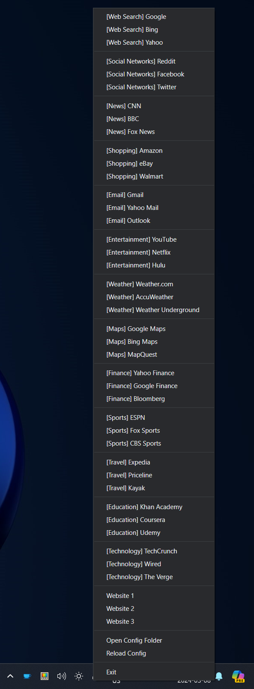

# TrayLinks

TrayLinks is a simple website launcher that is always ready in the system tray.

## Prerequisites

- Windows x64

## Usage

Simply run `traylinks.exe`, and you're good to go.

### Add and removing websites

- To edit the website list, click on the rocket icon and select `Open Config Folder`. 
- In this folder, you will find a `config.json` file. Use your preferred editor to modify this file. 
- To create a separator between items, add `{ "type": "separator" }` as an item in the list. 
- Once you've finished adding websites, click on the rocket icon again and select `Reload Config`.

### Important

Remember to check if the application is hidden inside the tray drawer (the ^ icon). 
To keep it always visible, you can drag and drop it into the tray area next to the ^ icon.

## Development

- `npm install`
  - Run this command after cloning the repository.
- `npm run package`
  - This command generates a package of the app.
- `npm run make`
  - This command generates an installer of the app.
- `npm run start`
  - Use this command to execute the app while developing.

## Screenshot

## License

This project uses the following license: MIT
